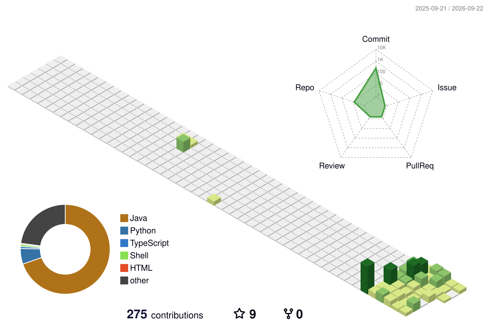

<div align="center">

<!-- Dot Matrix Portrait -->


<br>

<a href="https://github.com/harsh6131">
  
</a>

<br>


<br>

<a href="https://www.linkedin.com/in/harshvardhan-singh6131/">
  
</a>

<a href="mailto:singhharsh6131@gmail.com">
  
</a>

<a href="YOUR_PORTFOLIO_URL">
  
</a>

<a href="https://codeforces.com/profile/harsh__6131">
  
</a>

<a href="https://leetcode.com/u/harsxh__6131/">
  
</a>

<br><br>

</div>

  ## 🚀 About Me

```yaml
name: Harshvardhan Singh Jaisawat
role: CS Engineer & Developer
education: B.Tech CSE @ VIT Bhopal

focus:
  - Artificial Intelligence & Machine Learning
  - Data Structures & Algorithms
  - Competitive Programming
  - Software Development

currently_building:
  - SwachhVan
  - AI/ML Projects
  - Full-Stack Applications

currently_learning:
  - Machine Learning
  - Java
  - Python
  - DBMS & SQL
  - Web Development

philosophy: Build → Learn → Ship → Repeat

```


</div>

## 🏆 Competitive Programming

<p align="center">
  <b>As a competitive programmer, I continuously refine my algorithmic problem-solving skills.</b>
</p>

<div align="center">

<table width="100%">
<tr>

<!-- ==================== LEETCODE ==================== -->
<td align="center" width="50%" valign="top">

<h3>🧩 LeetCode</h3>

<a href="https://leetcode.com/u/harsxh__6131/">

</a>

</td>

<!-- ==================== CODEFORCES ==================== -->
<td align="center" width="50%" valign="top">

<h3>🔵 Codeforces</h3>

<a href="https://codeforces.com/profile/harsh__6131">

</a>

</td>


<tr>
<!-- ==================== CODECHEF ==================== -->
<td align="center" width="50%" valign="top">

<h3>🍴 CodeChef</h3>

<table width="90%">

<tr>
<td align="left">Username</td>
<td align="right"><b>—</b></td>
</tr>

<tr>
<td align="left">Stars</td>
<td align="right"><b>—</b></td>
</tr>

<tr>
<td align="left">Highest Rating</td>
<td align="right"><b>—</b></td>
</tr>

<tr>
<td align="left">Solved</td>
<td align="right"><b>— Problems</b></td>
</tr>

<tr>
<td colspan="2" align="center">
<br>
<a href="#">
View Profile →
</a>
</td>
</tr>

</table>

</td>


<!-- ==================== ATCODER ==================== -->
<td align="center" width="50%" valign="top">

<h3>🟢 AtCoder</h3>

<table width="90%">

<tr>
<td align="left">Username</td>
<td align="right"><b>—</b></td>
</tr>

<tr>
<td align="left">Rank</td>
<td align="right"><b>—</b></td>
</tr>

<tr>
<td align="left">Current Rating</td>
<td align="right"><b>—</b></td>
</tr>

<tr>
<td align="left">Highest Rating</td>
<td align="right"><b>—</b></td>
</tr>

<tr>
<td colspan="2" align="center">
<br>
<a href="#">
View Profile →
</a>
</td>
</tr>

</table>

</td>

</tr>
</table>

</div>

---

<p align="center">
  <b>🚀 Solve → Learn → Optimize → Repeat</b>
</p>

---

### 📌 Current Focus

* 🧠 Data Structures & Algorithms
* ⚡ Competitive Programming
* 🔍 Problem Solving
* 🎯 Coding Interviews
* 📈 Consistent Practice

> **Solve → Learn → Optimize → Repeat 🚀**

## 🚀 Featured Projects

### 🎓 CCRM-JAVA
Campus Course & Records Manager built using Java.

### 🪪 UIDAI Data Hackathon 2026
Data analysis and visualization project.

### 🧪 Chemical Equipment Visualiser
Python-based visualization project.

### 🧩 DSA
My Data Structures & Algorithms practice.

### ⚡ Codeforces Solutions
My competitive programming solutions.

---

<div align="center">
  
</div>


## 📚 Currently Learning

- Data Structures & Algorithms
- Java
- Python
- DBMS & SQL
- Web Development

---

## 📫 Connect With Me

- 🐙 [GitHub](https://github.com/harsh6131)
- 🧩 [LeetCode](https://leetcode.com/u/harsxh__6131/)
- 🚀 [Codeforces](https://codeforces.com/profile/harsh__6131)
---

<!--
**harsh6131/harsh6131** is a ✨ _special_ ✨ repository because its `README.md` (this file) appears on your GitHub profile.

Here are some ideas to get you started:

- 🔭 I’m currently working on ...
- 🌱 I’m currently learning ...
- 👯 I’m looking to collaborate on ...
- 🤔 I’m looking for help with ...
- 💬 Ask me about ...
- 📫 How to reach me: ...
- 😄 Pronouns: ...
- ⚡ Fun fact: ...
-->


